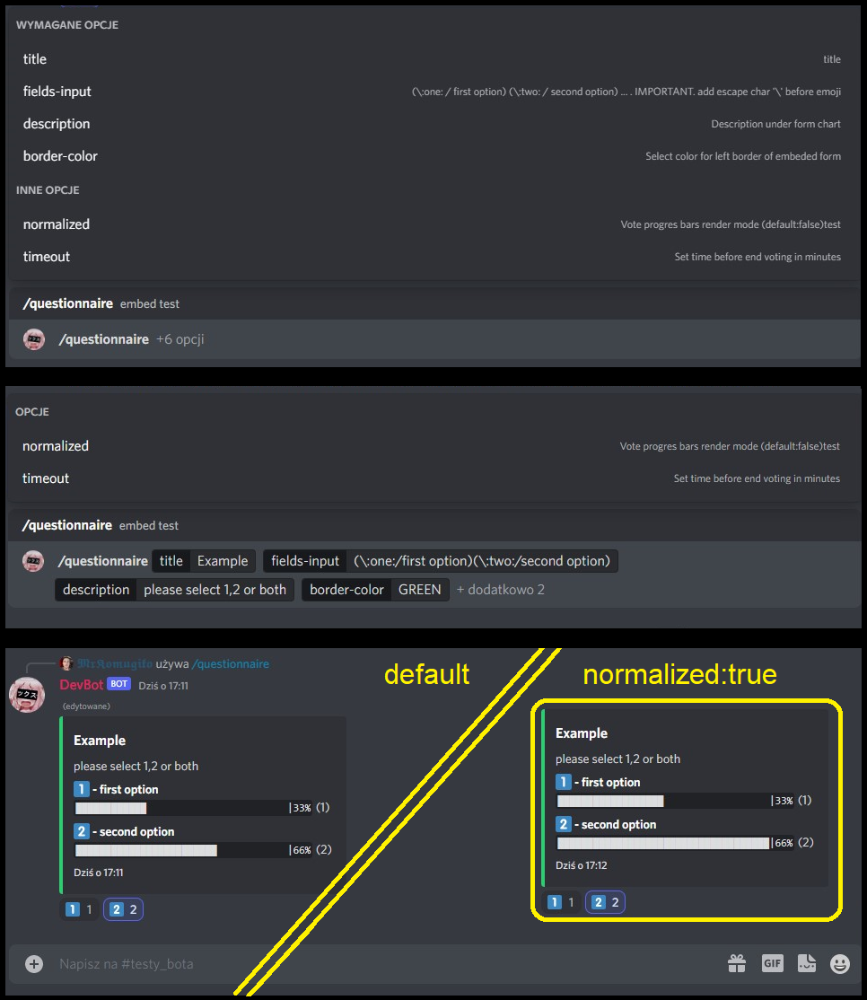

# KomugikoBot

Discord Bot

###  Table of Contents  
- [Stack](#stack)
- [Prerequisits](#prerequisits)
- [Slash Commands](#slashcommands)    
- [Screens](#screens)  

<a name="stackfront"/>

## Stack

- **Language** c#  
- **Framework** .NET6, Discord.NET  


<a name="prerequisits"/>

## Prerequisits

- create config.json file in directory KomugikoBot/**config.json**  
  ```json
  {
    "prefix": <prefix character : char>,
    "guild": {  
      "guildname": <guild Id : ulong>,
      "guildname_2": <guild Id : ulong>,
    },
    "token": {
      "botName": <token : string>
    }
  }
  ```
- modify **config.json** data for prefix ex. `"`,`>` IMPORTANT: dont use slash(`/`) character  
  - in case of string prefixes
    ```cs 
    // Komugikobot/PrefixHandler.cs
        41: if (!(message.HasStringPrefix(_config["prefix"][0], ref argPos) || 
        42:       message.HasMentionPrefix(_client.CurrentUser, ref argPos)))
        43:     return;
     ``` 
- modify guild name with guild id you allow acces and your bot token
  - register guilds  (you can add multiple guilds, min 1), 
    ```cs 
    // Komugikobot/Program.cs
        60: _client.Ready += async () => {
        61:      // Console.WriteLine("Bot ready!");
        62:      await sCommand.RegisterCommandsToGuildAsync(UInt64.Parse(config["guild:guildname"]));
        63:      await sCommand.RegisterCommandsToGuildAsync(UInt64.Parse(config["guild:guildname_2"]));
        64: };
    ```
  - login bot with provided token 
    ```cs 
    // Komugikobot/Program.cs
        69: await _client.LoginAsync(TokenType.Bot, config["token:botName"]);
    ```
    
<a name="slashcommands"/>

## Slash Commands

1 Questionary generator
  - Command `/questionnaire`  [screens](#screen_questionnaire)
    - Required arguments:
      - `title` : short string with questionary title
      - `fields-input` : string in format: `(\:one:/one) (\:two:/two) (\:cat:/other)` 
        - (`\emoji`/`label`) repeatitable
      - `description` : longer string describing questionary purpose 
      - `border-color` : selection list from discord collors
    - Optional arguments:
      - `timeout` : number represent minutes before finishing questionary
      - `normalized` : boolean select, rendering mode of chart bars normalized  
         ( bars length relative to higher value, highest rated option is a full bar )

<a name="screens"/>

## Overwiew - screens

<a name="screen_questionnaire"/>

### Questionnaire

